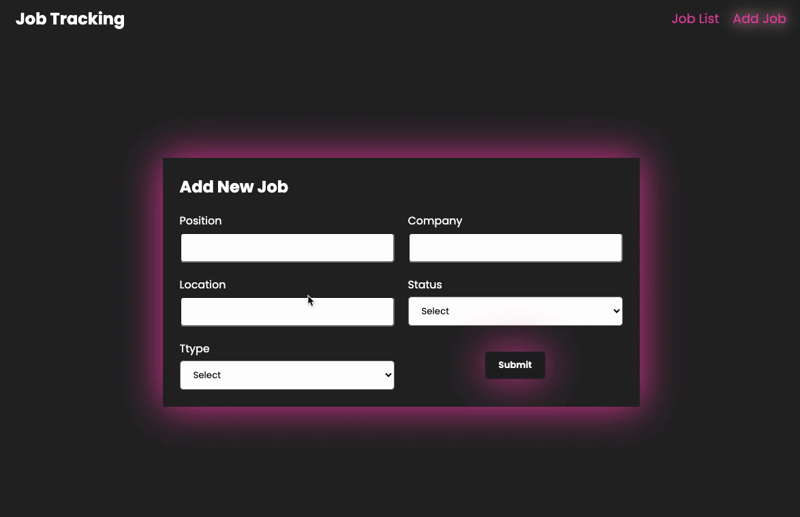

# <h1>Job-Tracking-App</h1>

It is designed to be fully responsive.

<h2> Programming Languages Used</h2>

Website is coded with JSX SCSS & REACT.JS

# Librarys

-react-router-dom
-axios
-react-toastify
-react-redux
-@reduxjs/toolkit
-tailwind
-uuid
-react-icons
-sass

<h2>Screen </h2>

# Job-Tracking-App
